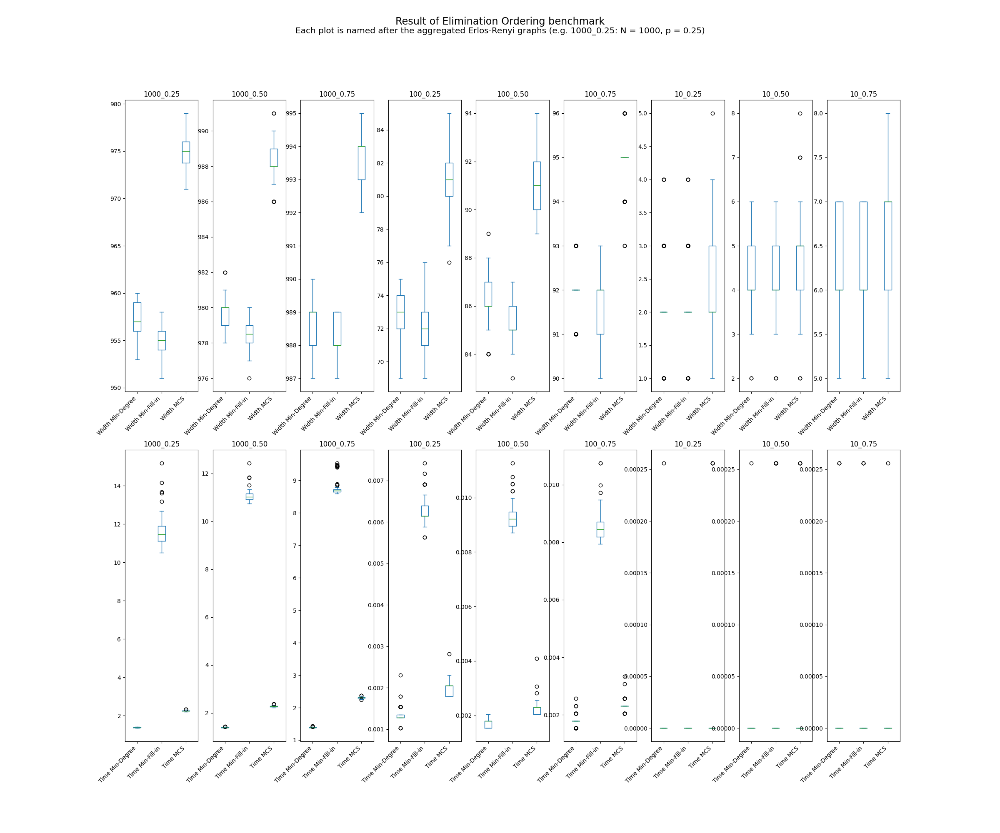

# Build instructions

You can try to use the VS Code configuration, otherwise use cmake.  
Something like  
`mkdir build`  
`cd build`  
`cmake -S ..`  
`make`  
should work.

# Generate graphs

Make sure you have the python package `networkx` installed.  
Use graphs.py to generate Erlos Renyi graphs with provided size and probability.  
`python graphs.py --help` for usage.  
Use the `-n` option to create multiple random graphs with same parameters.  
For a single graph use `-outfile` option to specify a filename, for multiple graphs use `-outfolder` to specify a folder to create the files in.  
When creating multiple graphs, the individual files will be named according to the scheme `ER_<# of vertices>_<edge probability>_<instance ID>.al`.

# Calculate elimination orderings

Use `build/treedecomp` or `.vscode/treedecomp` depending on how you built it to analyze graphs.

## Input format

Provide the graphs in networkx's adjacency list format (https://networkx.org/documentation/stable/reference/readwrite/adjlist.html)

Also tries to read files in DIMACS format. Make sure to have an edge from 0 in the first line if your numbering scheme is [0 -> N-1]. If the numbering scheme is [1 -> N] it will be converted to [0 -> N-1]! 

## Usage

To create an elimination ordering for a single file, use the `-s` option. You can also specify which heuristic to use.
Use `treedecomp -h` to print the usage string.
For example if you want to analyze a file `mygraph.al` located in a subfolder `data` using the Min-Fill-in heuristic, the command would be `../build/treedecomp -o -F mygraph.al`. The output will be printed to stdout.
You can use the `-v` option to get more verbose printing.

To analyze multiple files in benchmark mode, create a file that lists all files to analyze e.g. `filelist.txt` and use the `-l` option. The results will be saved to `results.csv`.

To convert an elimination ordering to a tree decomposition, use something like `../build/treedecomp -t mygraph.al mygraph.eo` where `mygraph.al` is the file of the graph itself and `mygrap.eo` is a file containing the corresponding elimination ordering. (Can be created by `../build/treedecomp -o -F mygraph.al > mygraph.eo` beforehand)

## Recreating benchmark results

Unfortunately the size of the input files prohibits an upload of the raw data. However by generating the graphs yourself it should be possible to reach a similar conclusion.
The steps for this are:

### Create the random graphs

`mkdir data`  
`python graphs.py -n 100 -outfolder data 10 0.25`  
`python graphs.py -n 100 -outfolder data 10 0.50`  
`python graphs.py -n 100 -outfolder data 10 0.75`  
`python graphs.py -n 100 -outfolder data 100 0.25`  
.  
.  
.  
`python graphs.py -n 100 -outfolder data 1000 0.75`  

### Create the file list

`cd data`  
`ls | grep '.al' > filelist.txt`

### Run the benchmark

Assumes `treedecomp` was built beforehand.  
`../build/treedecomp -l filelist.txt`

### Copy the results
`cd ..`  
`scp data/results.csv results.csv`

### Create the plot

Attention, this will overwrite an existing `plot.png`!  
`python plots.py`

# Result

# libTW graphs
The graphs contained in folder `libTW-graphs` are taken from https://www.treewidth.com 
This was done to get a comparison to a known implementation. The results can be observed in `libTW_plots.png`. MCS-min refers to the MCS heuristic where ties in the cardinality are broken by selecting the vertex with minimum degree. Similarly in MCS-max the vertex with maximum degree was selected.